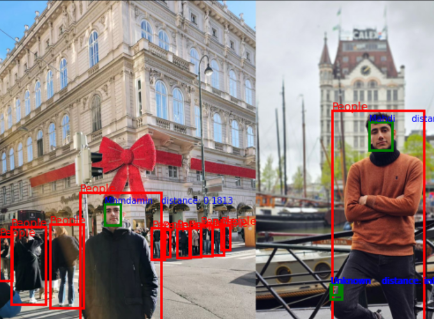

# Object-Face-Detection-Recognition

<p align="center">
  
</p>

## Contents
- [Overview](#overview)
- [Repository Structure](#repository-structure)
- [Features](#features)
- [Setup](#setup)
- [Usage](#usage)
- [Acknowledgements](#acknowledgements)

## Overview
This project combines Faster R-CNN, MTCNN, and FaceNet to perform multi-stage object detection and face recognition. The pipeline follows these steps:
1. **Faster R-CNN** detects objects (people and dogs) in an image.
2. **MTCNN** runs only on regions classified as 'people' to detect faces.
3. **FaceNet** encodes and recognizes detected faces against a database of known faces.

## Repository Structure
```
📂 Object-Face-Detection-Recognition
│── 📂 train_faster_rcnn/                   # Folder for training Faster R-CNN
│   ├── train_faster_rcnn.ipynb             # Jupyter Notebook for training
│   ├── README.md                           
│
│── 📂 hierarchical_detection/              # Full pipeline
│   ├── multi_stage_detection.ipynb         # Jupyter Notebook for the full pipeline
│   ├── README.md                           
│
│── 📂 encode_faces/                        # Encoding faces using FaceNet
│   ├── encode_faces.py                     # Python script for encoding faces
│   ├── README.md                           
│
│── 📂 models/                              # Trained models
│   ├── fasterrcnn_people_dog_trained.pth   # Trained Faster R-CNN model
│   ├── facenet_encodings.pkl               # Trained FaceNet embeddings
│
│── 📂 data/                                # Dataset and annotation files
│   ├── 📂 VOC2012_images/                  # Contains only images from Pascal VOC 2012 dataset
│   ├── train_Pascal_custom.csv             # Custom annotation file for training 
│   ├── test_Pascal_custom.csv              # Custom annotation file for testing 
│   ├── test.jpg                            # Example test image
│   ├── 📂 face_dataset/                    # Stores images for FaceNet encoding
│   │   ├── 📂 Alice/                       # Folder for person "Alice"
│   │   │   ├── img1.jpg                    # Sample image
│   │   │   ├── img2.jpg                    # Sample image
│   │   ├── 📂 Bob/                         # Folder for person "Bob"
│   │   │   ├── img1.jpg
│   │   │   ├── img2.jpg
│   │   ├── …                               # More persons
│
│── requirements.txt                        
│── README.md                               
```

## Features
- **Object Detection**: Identifies people and dogs using a fine-tuned Faster R-CNN model.
- **Face Detection**: Uses MTCNN to extract faces from detected 'person' objects.
- **Face Recognition**: Uses FaceNet embeddings to recognize known individuals.
- **Efficient Pipeline**: Runs MTCNN and FaceNet only on relevant regions to improve speed.

## Setup
1. Clone the repository:
   ```bash
   git clone https://github.com/Ariobarzanes98/FasterRCNN-MTCNN-FaceNet.git
   cd Object-Face-Detection-Recognition
   ```
2. Create and activate a Conda environment with Python 3.9:
   ```bash
   conda create --name face_detection_env python=3.9 -y
   conda activate face_detection_env
   ```

3. Install dependencies:
   ```bash
   pip install -r requirements.txt
   ```

## Usage

- [Run the Full Detection Pipeline](hierarchical_detection/) – Perform object detection with Faster R-CNN, apply face detection using MTCNN on detected people, and recognize faces with FaceNet in a sequential pipeline.
- [Encode Faces with FaceNet](encode_faces/) – If you want to generate and use your own face embeddings instead of the existing ones, follow this guide to process and store embeddings for recognition.
- [Train Faster R-CNN](train_faster_rcnn/) – If you want to train the object detection model instead of using the provided pre-trained weights, follow the instructions in this section.


## Acknowledgements

This implementation is based on code from several repositories:

- [Faster RCNN Webinar](https://github.com/howsam/faster-rcnn)
- [Face tutorial](https://github.com/pooya-mohammadi/Face)

